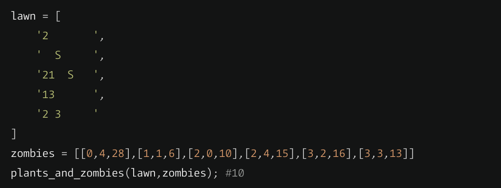

## Introduction

This kata is inspired by Plants vs. Zombies, a tower defense video game developed and originally published by PopCap Games.

The battlefield is the front lawn and the zombies are coming. Our defenses (consisting of pea-shooters) are in place and we've got the stats of each attacking zombie. Your job is to figure out how long it takes for them to penetrate our defenses.

## Mechanics
The two images below represent the lawn (for the test example below) at separate stages in the game.
Left: state at move 3, before shooters fire. Right:state at move 5, after shooters fire. (Moves are 0-based)

 - **Moves**: During a move, new zombies appear and/or existing ones move forward one space to the left. Then the shooters fire. This two-step process repeats.
If a zombie reaches a shooter's position, it destroys that shooter. In the example image above, the zombie at [4,4] on the left reaches the shooter at [4,2] and destroys it. The zombie has 1 health point remaining and is eliminated in the same move by the shooter at [4,0].
- **Numbered shooters** shoot straight (to the right) a given number of times per move. In the example image, the green numbered shooter at [0,0] fires 2 times per move.
 - **S-shooters** shoot straight, and diagonally upward and downward (ie. three directions simultaneously) once per move. In the example image, the blue and orange S-shooters can attack zombies in any of the blue and orange squares, respectively (if not blocked by other zombies).
At move 3 the blue shooter can only hit the zombie at [1,5] while the orange shooter hits each of the zombies at [1,5], [2,7], and [4,6] once for that move.
- **Shooting Priority**: The numbered shooters fire all their shots in a cluster, then the S-shooters fire their shots in order from right to left, then top to bottom. Note that once a zombie's health reaches 0 it drops immediately and does not absorb any additional shooter pellets.
In the example image, the orange S-shooter fires before the blue one.

## Input
Your function will receive two arguments:

- **Lawn Map**: An array/list consisting of strings, where each string represents a row of the map. Each string will consist of either " " (space character) which represents empty space, a numeric digit (0-9) representing a numbered shooter, or the letter S representing an S-shooter.
 - **Zombie Stats**: An array of subarrays representing each zombie, in the following format:
[i,row,hp] - where i is the move number (0-based) when it appears, row is the row the zombie walks down, and hp is the initial health point value of the zombie.
When new zombies appear, they start at the farthest right column of their row.
Input will always be valid.

## Output
Return the number of moves before the first zombie penetrates our defenses (by getting past column 0), or null/None if all zombies are eliminated.

Test Example

